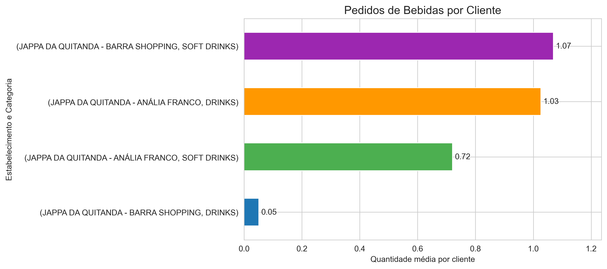
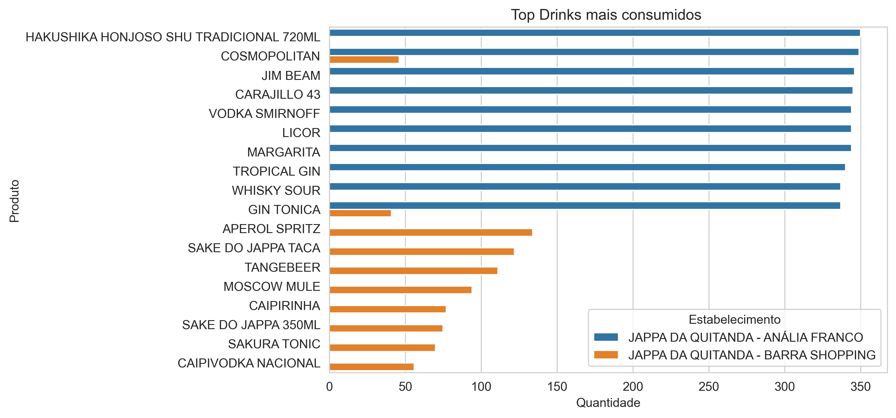
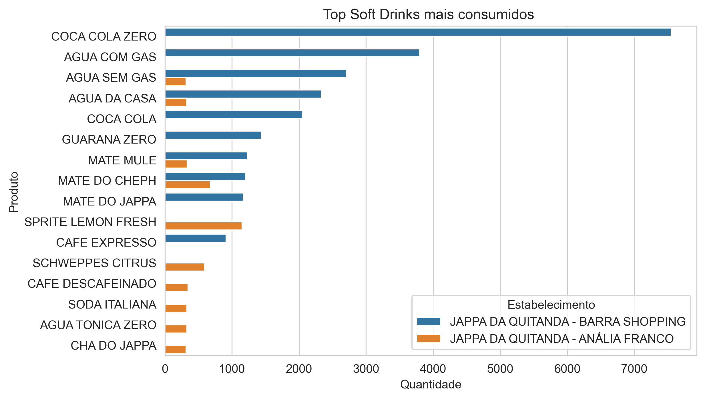

# Projeto Prático de Análise de Dados

## Base de Dados
Base de dados com informações de consumo de clientes em diferentes estabelecimentos.

## Atividades Realizadas
- Soma e agregação de dados
- Comparação entre categorias
- Análise simples de consumo
- Criação de gráficos para visualização

## Objetivo
Explorar os dados e apresentar informações de forma clara utilizando gráficos e comparações.

## Tecnologias Utilizadas

- Python
- Pandas
- Matplotlib
- Seaborn
- Jupyter Notebook

## Exemplos de Visualização

### Pedidos de Bebidas por Cliente

### Top Drinks Mais Consumidos

### Top Soft Drinks Mais Consumidos
